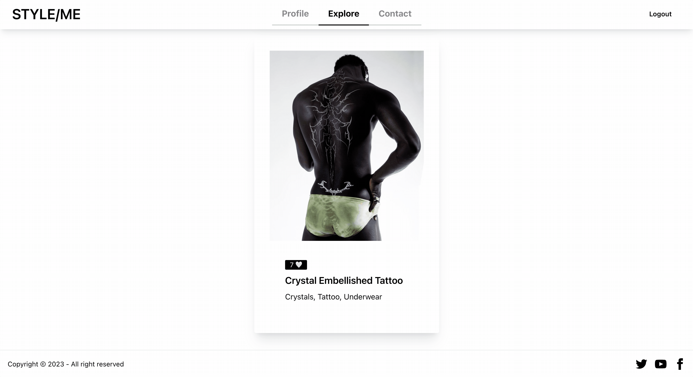
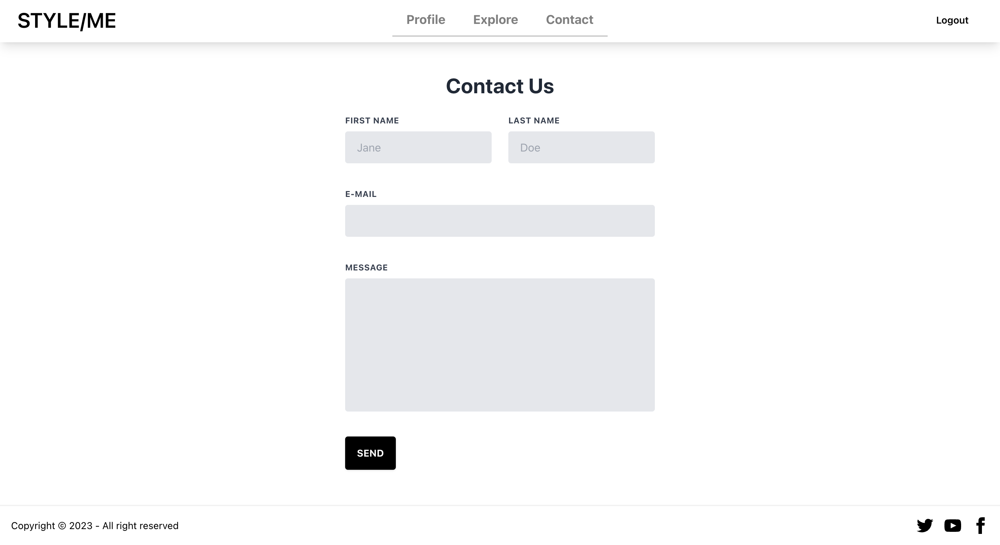
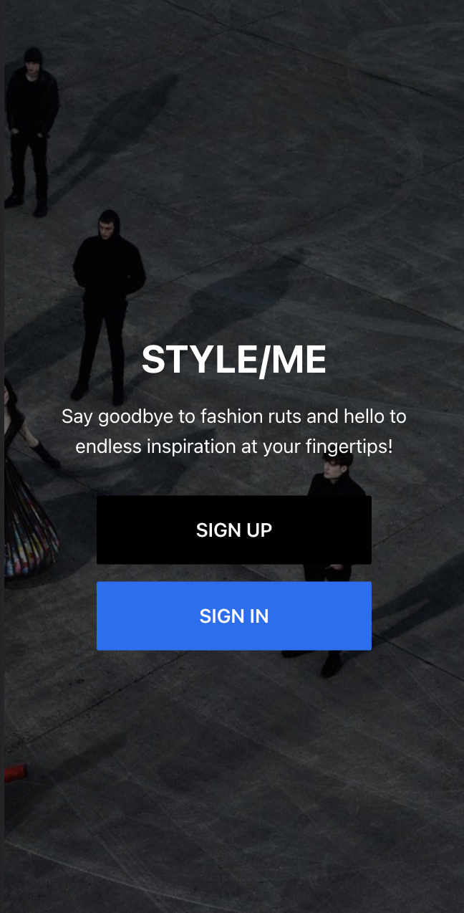
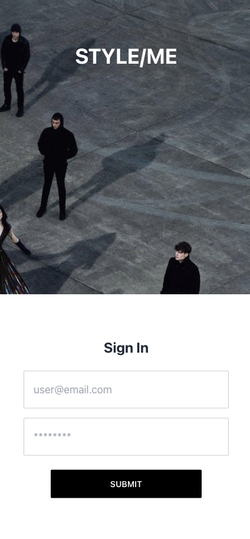
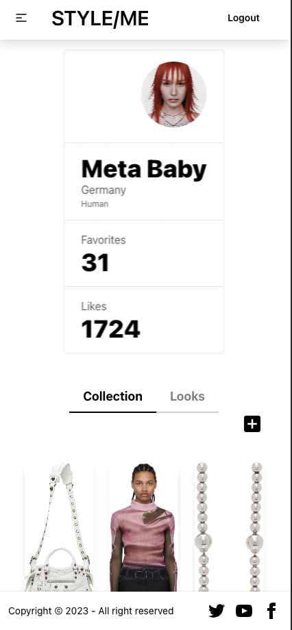
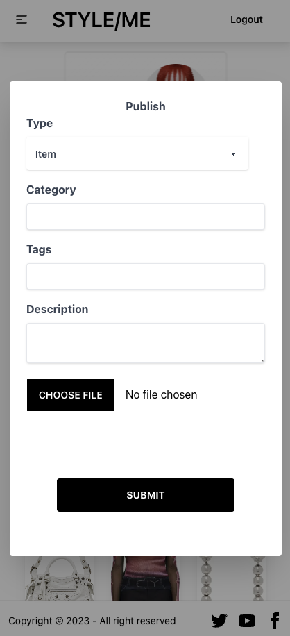
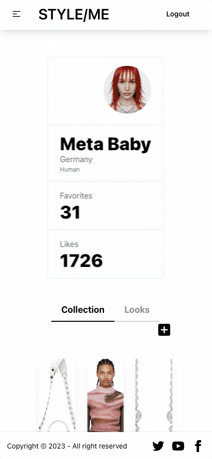
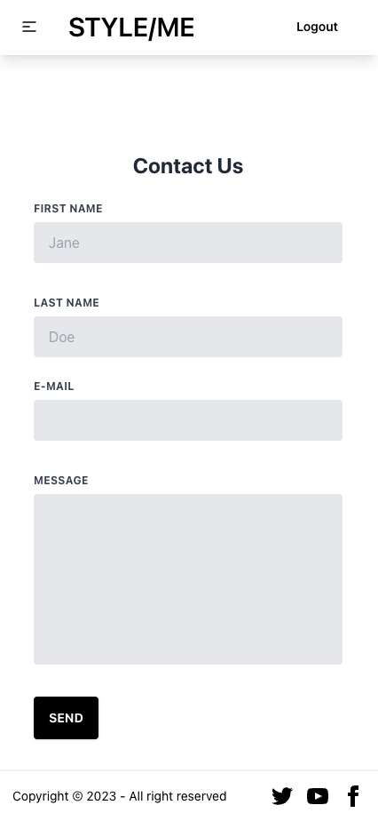

# Style/Me

Style/Me is a web application that allows users to organize their wardrobe digitally. The app provides a platform to store clothes and outfits in an organized manner, allowing users to easily browse and choose what to wear. Users can also share their looks with others and browse through a feed of posts from other users, interacting with them.

## Technologies Used

Front-end: React.js, TypeScript, Redux, Tailwind CSS, Daisy UI
Back-end: Express, Node.js, MongoDB, Mongoose, Google Cloud Storage for storing user-generated content

## Deployed Application

The Style/Me web application is deployed and accessible at [https://style-me-plum.vercel.app/](https://style-me-plum.vercel.app/). You can visit the deployed application to explore its features and functionality.

Please note that the link provided is the live deployment of the Style/Me web application.

The server for Style/Me is deployed on Vercel at [https://style-me-server.vercel.app/](https://style-me-server.vercel.app/). The database is hosted on MongoDB Atlas, a cloud-based database service, ensuring the availability and scalability of the backend infrastructure.

### Login
- username: admin@styleme.com
- password: admin

## Installation

To run Style/Me on your local machine, follow these steps:

1. Clone this repository.
2. Navigate to the client directory: `cd client`.
3. Install dependencies: `npm install`.
4. Start the development server: `npm start`.

The frontend will be accessible at `http://localhost:3000`.

5. Navigate to the server directory: `cd server`.
6. Install dependencies: `npm install`.
7. Start the server: `npm start`.

The backend will be accessible at `http://localhost:3001`.

For detailed instructions on setting up the backend and frontend, refer to the respective READMEs:

- Backend: [README](./server/README.md)
- Frontend: [README](./client/README.md)

## Usage

After starting the development server, you can access the frontend in your web browser at `http://localhost:3000`. Explore the application, create an account, add clothes and outfits to your wardrobe, and interact with other users.

## Contributing

If you want to contribute to the development of Style/Me, please follow the standard steps for contributing to open-source projects.

## License

The code for Style/Me is released under the MIT License.

## Screenshots
### Desktop

### Mobile

## Credits

- [React.js](https://reactjs.org/)
- [TypeScript](https://www.typescriptlang.org/)
- [Redux](https://redux.js.org/)
- [Tailwind CSS](https://tailwindcss.com/)
- [Daisy UI](https://daisyui.com/)
- [Express](https://expressjs.com/)
- [Node.js](https://nodejs.org/en/)
- [MongoDB](https://www.mongodb.com/)
- [Mongoose](https://mongoosejs.com/)
- [Google Cloud Storage](https://cloud.google.com/storage)
- [bcrypt](https://www.npmjs.com/package/bcrypt)
- [cors](https://www.npmjs.com/package/cors)
- [dotenv](https://www.npmjs.com/package/dotenv)
- [multer](https://www.npmjs.com/package/multer)
- [nodemon](https://www.npmjs.com/package/nodemon)
- [react-animated-heart](https://www.npmjs.com/package/react-animated-heart)
- [react-hook-form](https://www.npmjs.com/package/react-hook-form)
- [react-redux](https://www.npmjs.com/package/react-redux)
- [react-router-dom](https://www.npmjs.com/package/react-router-dom)
- [react-spinners](https://www.npmjs.com/package/react-spinners)
- [typescript](https://www.npmjs.com/package/typescript)
